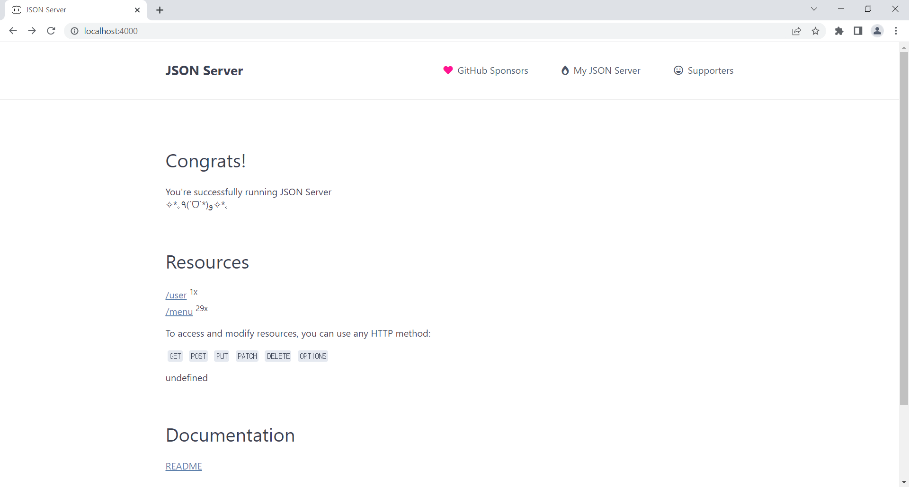
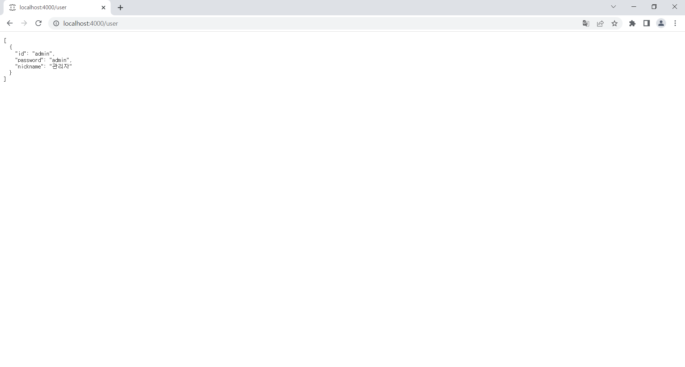
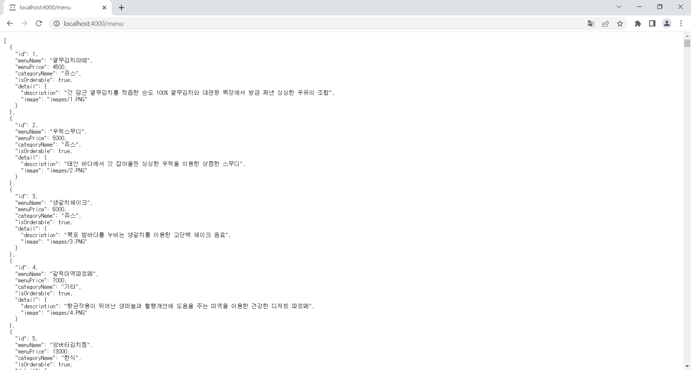

# redux crud

## json-server 설치

- 프로젝트 내부에 mock 이라는 경로를 생성하고 안에 db.json 파일을 넣는다.
- mock 경로 우클릭 후 통합 터미널에서 열기를 선택해 터미널 창을 하나 더 연다. 
  
```
npx json-server ./db.json --port 4000
```

- 가상의 데이터 서버의 역할을 할 수 있는 json-server를 db.json 파일을 이용해 4000번 포트로 동작시킨다.
   
- url 요청을 통해 구동 확인한다. 
  


- 객체의 키 값(user)으로 요청할 수 있다. 



- 객체의 키 값(menu)으로 요청할 수 있다. 



- 자동으로 id 속성을 사용해서 다뤄지기 때문에 객체가 반드시 id 속성을 갖도록 한다.

## 추가 라이브러리 설치

```
npm install react-router-dom
npm install redux
npm install react-redux
npm install redux-actions
npm install redux-thunk
npm install redux-logger
npm install redux-devtools-extension
```

- 라우팅을 위한 react-router-dom 라이브러리와 전역 상태 관리, 미들 웨어 사용을 위한 redux 관련 라이브러리를 추가 설치한다. 
  
## axios

```
npm install axios
```

- API 요청을 보내기 위해 사용할 axios 라이브러리를 설치한다. 

```
import axios from 'axios';

const DOMAIN = 'http://localhost:4000';

export const request = async (method, url, data) => {
    return await axios({
        method,
        url : `${DOMAIN}${url}`,
        data
    })
      .then(res => res.data)
      .catch(error => console.log(error));
};
```

- method
  - GET (Read) : /menu - 전체 메뉴 조회, 또는 /menu/1 - 1번 메뉴 조회
  - POST (Create) : /menu - 메뉴 등록
  - PUT (Update) : /menu/1 - 1번 메뉴 수정
  - DELETE (Delete) : /menu/1 - 1번 메뉴 삭제